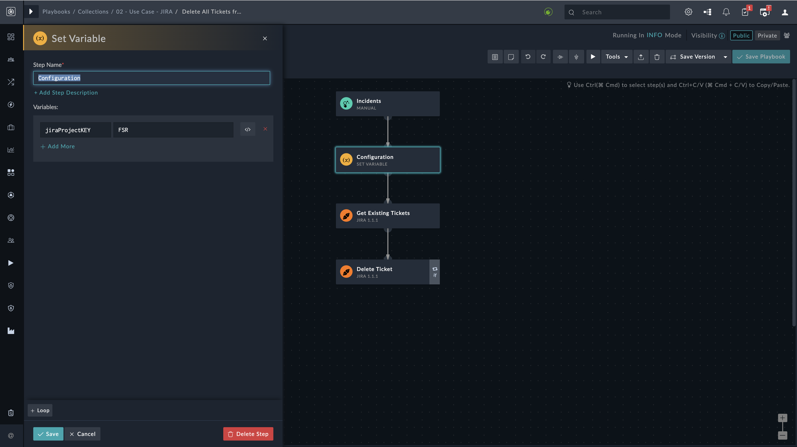

[Home](../README.md) |
|--------------------------------------------|

# Usage

This solution pack helps you to understand the steps FortiSOAR takes to respond to organisations that choose to keep SOC incident management on JIRA while utilising FortiSOAR's automation and orchestration capabilities. To discover how this solution bundle automation satisfies your needs, see the section [Jira](#jira).

# Jira

Solution pack contains playbook which helps in following ways:
* An automated synchronisation with Jira is made possible by the Post Create playbook on alert , which allows creation of **Issue** in Jira with the same alert's `Severity`, `Status` and `Description`
* The Post Update playbook on alert facilitates an automated synchronisation with Jira, enabling the updating of Jira **Issue** with the corresponding changes made to the alert's `Severity`, `Status` or `Description`
* A playbook is used to automatically update Jira **Issue** whenever a comment is added to an alert.
* A manual trigger playbook is utilized to automatically close alerts if the corresponding **Issue** in Jira is marked as 'Done'
* A manual trigger playbook is implemented to delete all tickets or **Issue** associated with a specified project of Jira.

> **Note**: Each of the associated playbooks includes a `Configuration` step that features a **jiraProjectKEY** key. This key permits you to specify the Project Key from Jira that you wish to employ for automation purposes.

